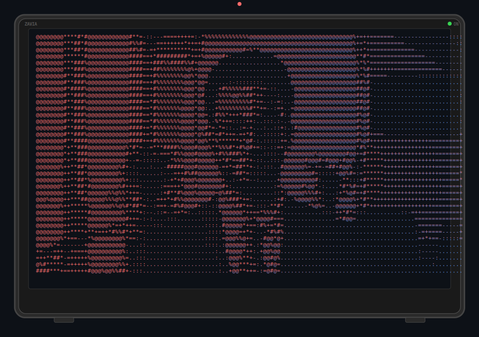

<div align="center">



```text
 __  __  ___  _  _   _   _  _ _  _ ___ ___    ____  ___   _____  _   _ ___  
|  \/  |/ _ \| || | /_\ | \| | \| | __|   \  |_  / /_\ \ / / _ \| | | |   \ 
| |\/| | (_) | __ |/ _ \| .` | .` | _|| |) |  / / / _ \ V / (_) | |_| | |) |
|_|  |_|\___/|_||_/_/ \_\_|\_|_|\_|___|___/  /___/_/ \_\_| \___/ \___/|___/ 
```

[](https://git.io/typing-svg)

<br>

<a href="https://github.com/mohaned122"></a>
<a href="https://github.com/mohaned122"></a>
<a href="https://github.com/mohaned122"></a>

</div>

<br>

```bash
$ whoami
> Mohanned Zayoud · Software Engineering Student · Full Stack Developer
```

---

```bash
$ skills
> Java · Spring Boot · MySQL · Angular · TypeScript · Flutter · Dart · Python · PyTorch · Linux · Git · GitHub
```

<div align="center">

<a href="https://skillicons.dev"></a>

</div>

---

<div align="center">

**PFE** — Spring Boot + Angular &nbsp;·&nbsp; **Backend** — APIs & distributed systems &nbsp;·&nbsp; **Mobile** — Flutter & Dart &nbsp;·&nbsp; **Distributed** — networking & architecture

</div>

---

<div align="center">



</div>

---

<div align="center">

<a href="https://mohannedzayoud.web.app"></a>
<a href="https://linkedin.com/in/mohanned-zayoud-ab9464258/"></a>
<a href="mailto:mohannidzayoud@gmail.com"></a>
<a href="tel:51916715"></a>

</div>

---

> *"Building the future, one commit at a time."*
>
> <a href="https://github.com/mohaned122?tab=repositories"></a>
> <a href="https://github.com/mohaned122?tab=repositories"></a>
